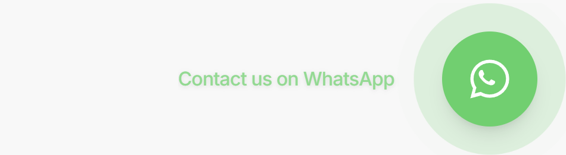
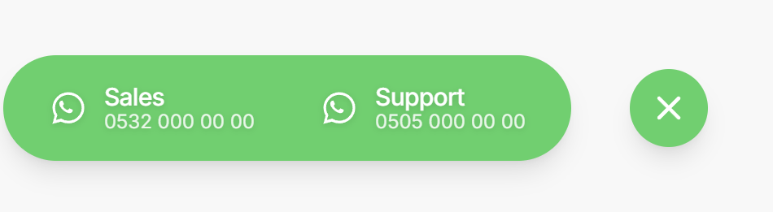

# react-whatsapp-button

A modern, customizable WhatsApp floating action button with multi-number support, built for React and Next.js applications.

## Preview

### Closed state



### Open state



## Features

- Single or multiple WhatsApp numbers
- Expandable menu with a maximum of 2 contact items for better mobile usability
- Fully customizable button size: `sm`, `md`, `lg`
- Customizable background color and text/icon color
- Optional closed label next to the floating button
- Optional phone number display under each label
- Built-in accessibility improvements
- Keyboard support with `Escape` to close the menu
- Click outside to close
- Smooth animations with `prefers-reduced-motion` support
- Works with WhatsApp Web links by default
- Optional WhatsApp app deep link support

## Tech Stack

- React
- Next.js
- TypeScript
- Tailwind CSS

## Repository Structure

```txt
react-whatsapp-button/
├─ assets/
│  ├─ screenshot-closed.png
│  └─ screenshot-open.png
├─ components/
│  └─ whatsapp-button.tsx
├─ LICENSE
└─ README.md
```

## Installation

Copy the component into your project:

```txt
components/whatsapp-button.tsx
```

No external dependencies are required.

## Usage

```tsx
import { WhatsAppButton } from "@/components/whatsapp-button";

export function Example() {
  return (
    <WhatsAppButton
      ariaLabel="Contact via WhatsApp"
      title="Contact via WhatsApp"
      closedLabel="Contact us on WhatsApp"
      items={[
        {
          label: "Sales",
          phone: "905xxxxxxxxx",
          message: "Hi, I need info.",
        },
        {
          label: "Support",
          phone: "905xxxxxxxxx",
          message: "Hi, I need help.",
        },
      ]}
    />
  );
}
```

## Single Number Example

```tsx
import { WhatsAppButton } from "@/components/whatsapp-button";

export function Example() {
  return (
    <WhatsAppButton
      ariaLabel="Contact via WhatsApp"
      title="Contact via WhatsApp"
      items={[
        {
          label: "WhatsApp",
          phone: "905xxxxxxxxx",
          message: "Hello! I would like to get more information.",
        },
      ]}
    />
  );
}
```

## Customization

### Button Size

```tsx
<WhatsAppButton size="sm" />
<WhatsAppButton size="md" />
<WhatsAppButton size="lg" />
```

Default:

```tsx
size="md"
```

### Colors

```tsx
<WhatsAppButton
  color="#25D366"
  textColor="#ffffff"
/>
```

Default values:

```tsx
color="#25D366"
textColor="#ffffff"
```

### Hide Closed Label

```tsx
<WhatsAppButton showClosedLabel={false} />
```

When `showClosedLabel` is set to `false`, the text next to the floating button is hidden.

This only applies when the component has multiple valid contact items.

### Hide Phone Numbers

```tsx
<WhatsAppButton showPhoneNumber={false} />
```

When `showPhoneNumber` is set to `false`, only the item labels are displayed inside the menu.

### Disable Pulse Animation

```tsx
<WhatsAppButton showPulse={false} />
```

### Prefer WhatsApp App Deep Link

```tsx
<WhatsAppButton preferAppLink />
```

By default, the component uses `https://wa.me`, which is the most predictable option across desktop, Android, and iOS.

For most production websites, keeping `preferAppLink={false}` is recommended.

## Props

| Prop | Type | Default | Description |
| --- | --- | --- | --- |
| `items` | `WhatsAppButtonItem[]` | `[]` | List of WhatsApp contact items |
| `ariaLabel` | `string` | `"Contact via WhatsApp"` | Accessible label for the button |
| `closedLabel` | `string` | `"WhatsApp"` | Text shown next to the button when the menu is closed |
| `showClosedLabel` | `boolean` | `true` | Shows or hides the closed label next to the floating button |
| `title` | `string` | `"Contact via WhatsApp"` | Native title attribute |
| `className` | `string` | `""` | Additional class names |
| `size` | `"sm" \| "md" \| "lg"` | `"md"` | Button size |
| `color` | `string` | `"#25D366"` | Main background and accent color |
| `textColor` | `string` | `"#ffffff"` | Icon and text color |
| `showPhoneNumber` | `boolean` | `true` | Shows or hides the phone number under each label |
| `showPulse` | `boolean` | `true` | Enables or disables pulse animation |
| `preferAppLink` | `boolean` | `false` | Tries `whatsapp://` before falling back to `wa.me` |
| `phoneFormatter` | `(phone: string) => string \| undefined` | Built-in formatter | Custom phone number formatter |

## Item Type

```ts
type WhatsAppButtonItem = {
  label: string;
  phone?: string;
  message?: string;
};
```

## Accessibility

The component includes:

- `aria-label`
- `aria-expanded`
- `aria-controls`
- `role="menu"`
- `role="menuitem"`
- Keyboard support with `Escape`
- Click outside to close
- Reduced motion support with Tailwind's `motion-safe` utilities

## Platform Compatibility

Works across modern browsers, including iOS Safari.

For best results, keep the default configuration:

```tsx
preferAppLink={false}
```

This uses `https://wa.me`, which lets the browser and operating system decide whether to open WhatsApp directly or continue through the browser.

## Mobile UX

To keep the floating menu compact and usable on mobile devices, the component only renders the first 2 valid contact items.

## License

MIT
